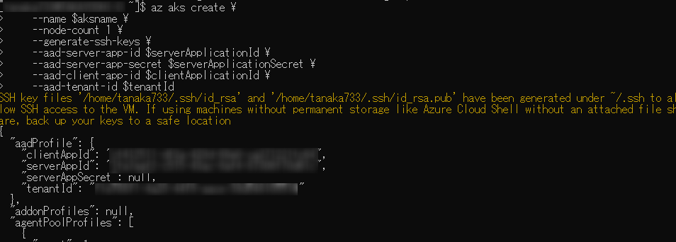

# Azure AD統合を有効化したクラスターの作成

Azure AD統合を有効化したクラスターを作成します。
まずAKSクラスターの名前を設定し、作成するAzure ADアプリに利用します。

```
aksname="decode2019cluster"
```

サーバー側のAzure ADアプリを作成します。

```
serverApplicationId=$(az ad app create \
    --display-name "${aksname}Server" \
    --identifier-uris "https://${aksname}Server" \
    --query appId -o tsv)
```

アプリケーションのグループメンバーシップを更新します。

```
az ad app update --id $serverApplicationId --set groupMembershipClaims=All
```

サービスプリンシパルを作成します。

```
az ad sp create --id $serverApplicationId
```

シークレットを取得します。

```
serverApplicationSecret=$(az ad sp credential reset \
    --name $serverApplicationId \
    --credential-description "AKSPassword" \
    --query password -o tsv)
```

Azure ADにアクセス許可を与えます。
以下で使うUUID形式の文字列はそれぞれ固有の意味を持っているので変更しないでください。
参考ドキュメント: [https://github.com/mjisaak/azure-active-directory](https://github.com/mjisaak/azure-active-directory)

```
az ad app permission grant --id $serverApplicationId --api 00000003-0000-0000-c000-000000000000
az ad app permission admin-consent --id  $serverApplicationId
```

クライアント側のAzure ADアプリを作成します。

```
clientApplicationId=$(az ad app create \
    --display-name "${aksname}Client" \
    --native-app \
    --reply-urls "https://${aksname}Client" \
    --query appId -o tsv)

az ad sp create --id $clientApplicationId
```

OAuth2の認証設定をします。

```
oAuthPermissionId=$(az ad app show --id $serverApplicationId --query "oauth2Permissions[0].id" -o tsv)

az ad app permission add --id $clientApplicationId --api $serverApplicationId --api-permissions $oAuthPermissionId=Scope
az ad app permission grant --id $clientApplicationId --api $serverApplicationId
```

AKSクラスターを作成するリソースグループを作成します。名前およびリージョンは好きな値を指定してください。

```
az group create --name decodeaksdemo --location westus2
```

作成したリソースグループとリージョンをAzure CLIの既定値として利用します。このコマンドを省略する場合は、以降のコマンドごとにリソースグループを指定する必要があります。

```
az configure --defaults location=westus2 group=decodeaksdemo
```

AKSクラスターを作成します。作成には数分かかります。

```
tenantId=$(az account show --query tenantId -o tsv)

az aks create \
    --name $aksname \
    --node-count 1 \
    --generate-ssh-keys \
    --aad-server-app-id $serverApplicationId \
    --aad-server-app-secret $serverApplicationSecret \
    --aad-client-app-id $clientApplicationId \
    --aad-tenant-id $tenantId
```

作成が完了するとこのようにクラスターに関するJSONが出力されます。



AKSクラスターの管理者資格情報を取得します。AKSクラスター作成時に表示されるSSHキーは仮想マシンへのログイン時に必要なもので、こちらはkubernetesクラスターの管理者としての認証に必要なものです。

```
az aks get-credentials --name $aksname --admin
```

次にAzure AD統合でのログインを確かめるために、Azure CLIでログインしているユーザーが同じAzure　ADテナント内にいる場合はuserPrincipalNameを、異なる場合はobjectIdを取得します。

```
az ad signed-in-user show --query userPrincipalName -o tsv
```

このディレクトリにある`basic-azure-ad-binding.yaml`の最後の行の`userPrincipalName_or_objectId`を今取得した値に置き換え、次のコマンドを実行します。

```
kubectl apply -f basic-azure-ad-binding.yaml
```

クラスターの管理者ではなく、一般ユーザーとしての認証に置き換えます。

```
az aks get-credentials  --name $aksname --overwrite-existing
```

クラスターのすべてのPodの情報を取得するコマンドを実行します。

```
kubectl get pods --all-namespaces
```

すると、ブラウザーを開いて認証するようにもとめられるので、Azure CLIでログインしたユーザーでログインし、認証キーを入力します。するとPodの情報を取得できます。


# 参考資料

[https://docs.microsoft.com/ja-jp/azure/aks/azure-ad-integration-cli](https://docs.microsoft.com/ja-jp/azure/aks/azure-ad-integration-cli)
