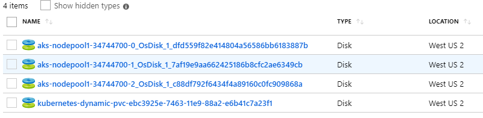
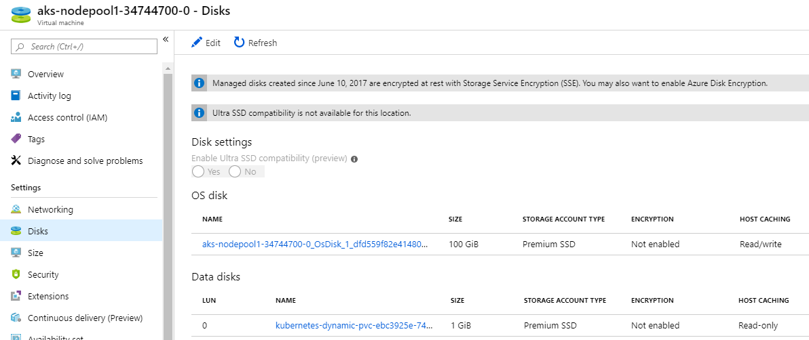
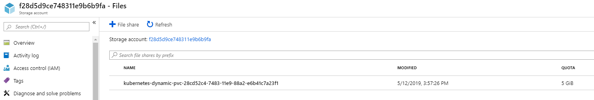
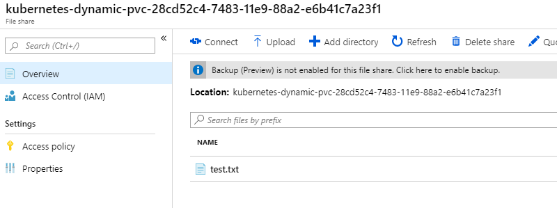
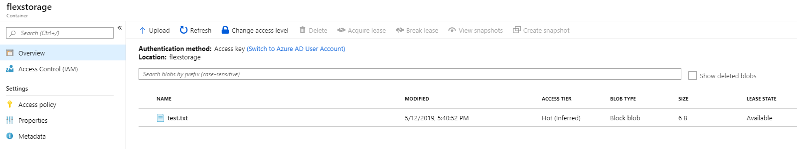

# ストレージクラスの使用

このドキュメントではストレージクラスの使用について説明します。
Azure DiskとAzure FileについてはAKS作成時にデフォルトで動的プロビジョニングが利用可能なストレージクラスが用意されています。
また既存のAzure Diskをボリュームとして利用する静的プロビジョニングの利用例として、Azure Diskのバックアップと復元を紹介しています。
Azure Diskについては仮想マシンのサイズによって接続可能な数の上限があるため、それを超えるときの挙動を検証しています。
また、このような制限をなくして使いやすくするためのdyskやblobfuseといったプレビュー機能についても紹介しています。

## デフォルトのストレージクラスの利用

AKSクラスターを作成するとデフォルトでストレージクラスが利用できます。describeコマンドで確認してみます。

```
kubectl describe sc
```

`default`と`managed-premium`という2つが利用でき、2つの違いはストレージアカウントが`Standard_LRS`と`Premium_LRS`ということが確認できます。

```
Name:            default
IsDefaultClass:  Yes
Annotations:     kubectl.kubernetes.io/last-applied-configuration={"apiVersion":"storage.k8s.io/v1beta1","kind":"StorageClass","metadata":{"annotations":{"storageclass.beta.kubernetes.io/is-default-class":"true"},"labels":{"kubernetes.io/cluster-service":"true"},"name":"default","namespace":""},"parameters":{"cachingmode":"ReadOnly","kind":"Managed","storageaccounttype":"Standard_LRS"},"provisioner":"kubernetes.io/azure-disk"}
,storageclass.beta.kubernetes.io/is-default-class=true
Provisioner:           kubernetes.io/azure-disk
Parameters:            cachingmode=ReadOnly,kind=Managed,storageaccounttype=Standard_LRS
AllowVolumeExpansion:  <unset>
MountOptions:          <none>
ReclaimPolicy:         Delete
VolumeBindingMode:     Immediate
Events:                <none>


Name:            managed-premium
IsDefaultClass:  No
Annotations:     kubectl.kubernetes.io/last-applied-configuration={"apiVersion":"storage.k8s.io/v1beta1","kind":"StorageClass","metadata":{"annotations":{},"labels":{"kubernetes.io/cluster-service":"true"},"name":"managed-premium","namespace":""},"parameters":{"cachingmode":"ReadOnly","kind":"Managed","storageaccounttype":"Premium_LRS"},"provisioner":"kubernetes.io/azure-disk"}

Provisioner:           kubernetes.io/azure-disk
Parameters:            cachingmode=ReadOnly,kind=Managed,storageaccounttype=Premium_LRS
AllowVolumeExpansion:  <unset>
MountOptions:          <none>
ReclaimPolicy:         Delete
VolumeBindingMode:     Immediate
Events:                <none>
```

## 既存のストレージクラスによるAzure Diskの利用

まず、この既存のストレージクラスを利用してAzure Diskをプロビジョニングします。
`azure-premium.yaml`を使ってPersistent Volume Claimを作成します。
Azure Diskの場合、`accessModes`は`ReadWriteOne`のみです。
`storageClassName`に`managed-premium`を指定しているため、Premium_LRSが利用されます。
省略するとデフォルト指定（`storageclass.beta.kubernetes.io/is-default-class=true`）されているdefaultという名前のストレージクラスが利用されます。

```
apiVersion: v1
kind: PersistentVolumeClaim
metadata:
  name: azure-managed-disk
spec:
  accessModes:
  - ReadWriteOnce
  storageClassName: managed-premium
  resources:
    requests:
      storage: 1Gi
```

作成後、Azure Diskのプロビジョニングが完了するとVolume名が表示されます。

```
kubectl create namespace storage-test
kubectl create -f azure-premium.yaml
kubectl get pvc -w
```

```
NAME                 STATUS    VOLUME                                     CAPACITY   ACCESS MODES   STORAGECLASS      AGE
azure-managed-disk   Bound     pvc-ebc3925e-7463-11e9-88a2-e6b41c7a23f1   1Gi        RWO            managed-premium   12s
```

このように表示されている場合、`kubernetes-dynamic-pvc-ebc3925e-7463-11e9-88a2-e6b41c7a23f1`（`kubernetes-dynamic-<Volume名>`）という名前でAzure Diskがプロビジョニングされていることがわかります。



次にこのPVCを利用するPodを配置してみます。

```
kubectl create -n storage-test -f disk-pod.yaml
```

`kubectl get node -o wide`でこのPodが配置されたノード名を確認し、該当のAzure仮想マシンを調べると先ほど作成されたディスクが接続されていることがわかります。



### 仮想マシンの制限を超えるディスクの接続

Azureの仮想マシンはインスタンスサイズによって接続できるディスクの上限が決まっています。
今回利用しているクラスターではStandard_DS2_v2を使っており、8つまでのディスクが接続できます。
そこで、9つのAzure Diskを利用するPodを配置した際の挙動を確認してみます。
まず、9つ分のPVCを作成します。

```
kubectl create -n storage-test -f azure-disks.yaml
```

次に作成した9つのPVCを利用するPodを配置します。

```
kubectl create -n storage-test  -f toomanydisks-pod.yaml
```

`kubectl get pod`で確認するとPending状態になっていることがわかります。`kubectl get event`するとその理由が確認できます。

```
6s          6s           1         manydiskspod-deployment-5b4575c9bc-6rqzp.159ddbcab6ccd810   Pod                                 Warning   FailedScheduling        default-scheduler             0/3 nodes are available: 3 node(s) exc    0/3 nodes are available: 3 node(s) exceed max volume count.
```

`exceed max volume count`とあるように、仮想マシンごとの接続できるディスクの数の上限をkubernetesのスケジューラーが認識して、スケジュールできるnodeがないのでPending状態になっています。
このスケジューラーによるインスタンスサイズごとのディスク上限の考慮はkubernetes 1.12で導入されました。

## ストレージクラスの作成によるAzure Fileの利用

Azure DiskはReadWriteOneなストレージであるため、複数のPodから共有するストレージが欲しい場合Azure Fileが利用可能です。
（もちろん、共有ストレージはスケールしづらいので、そもそも共有ストレージを使わないようにする考え方もあります）
Azure Fileもストレージクラスを作成してdynamic provisioningすることができます。
デフォルトでは作成されていないため、ストレージクラスの作成から行います。
Azure Diskとの違いは、Azure Fileの場合マウントオプションを指定できます。
デフォルトの権限が`0755`であるため、それを変更したい場合やuidやgidを明示的に指定したい場合に利用できます。

```
mountOptions:
  - dir_mode=0777
  - file_mode=0777
  - uid=1000
  - gid=1000
```

```
kubectl create -f azure-file-sc.yaml
```

加えて必要なアクションを行うためのロールを作成します。

```
kubectl apply -n storage-test -f azure-pvc-roles.yaml
```

PVCを作成します。

```
kubectl apply -n storage-test -f azure-file-pvc.yaml
```

すると作成したPVCに対応するファイル共有がストレージアカウントに作成されていることがわかります。



Azure Fileを利用するPodを配置します。

```
kubectl apply -n storage-test -f file-pod.yaml
```

配置後、PodにログインしてAzure Fileをマウントしたディレクトリにファイルを書き込んでみます。

```
kubectl exec -n storage-test -it mypod3-deployment-77fc467776-9ghb8 /bin/bash
# echo "hello" >> /mnt/azure/test.txt
# ls -ll /mnt/azure/
total 1
-rwxrwxrwx 1 1000 1000 6 May 12 07:04 test.txt
# exit
```

するとファイル共有にファイルが作成していることが確認できます。



## スナップショットの作成と静的プロビジョニングを利用した復元

Azure DiskやAzure Fileを利用している場合、格納したデータのバックアップは自分で管理する必要があります。
ここでは、Azure Diskのスナップショットを利用してバックアップを作成し、復元するために静的プロビジョニングを利用してみます。
静的プロビジョニングは既存のManaged Diskをボリュームとして利用する場合にも使えます。

まず、テストのためにAzure Diskを利用しているPodにログインしてファイルを書き込んでみます。

```
kubectl exec -n storage-test -it mypod1-deployment-7fbf766876-drjcm /bin/bash
# echo "hello" >> /mnt/azure/test.txt
# exit
```

PVCの名前から、該当するAzure DiskのリソースIDを取得します。

```
az disk list --query '[].id | [?contains(@,`pvc-ebc3925e-7463-11e9-88a2-e6b41c7a23f1`)]' -o tsv
```

取得したリソースIDを指定してスナップショットを作成します。

```
az snapshot create --resource-group MC_decodeaksdemo_decode2019cluster_westus2 --name pvcSnapshot --source /subscriptions/<subscription_Id>/resourceGroups/MC_DECODEAKSDEMO_DECODE2019CLUSTER_WESTUS2/providers/Microsoft.Compute/disks/kubernetes-dynamic-pvc-ebc3925e-7463-11e9-88a2-e6b41c7a23f1
```

スナップショットからDiskを作成します。

```
az disk create --resource-group MC_decodeaksdemo_decode2019cluster_westus2 --name pvcRestored --source pvcSnapshot
```

作成時にDiskのリソースIDが表示されるので記録しておきます。
もしくは次のコマンドで確認します。

```
az disk show --resource-group MC_decodeaksdemo_decode2019cluster_westus2 --name pvcRestored --query id -o tsv
```

静的プロビジョニングを利用する場合、volumeは次のように指定します。
diskNameはdiskURIと冗長ですが両方指定します。

```
volumes:
  - name: volume
    azureDisk:
      kind: Managed
      diskName: pvcRestored
      diskURI: /subscriptions/<subscriptionId>/resourceGroups/MC_decodeaksdemo_decode2019cluster_westus2/providers/Microsoft.Compute/disks/pvcRestored
```

Podを配置します。

```
kubectl create -n storage-test restored-disk-pod.yaml 
```

配置したPodにログインしてテストのために書き込んだファイルを確認してみます。

```
kubectl exec -n storage-test mypod4-deployment-74cdf9888f-hjr62 cat /mnt/azure/test.txt
hello
```

## 制限を考慮したストレージの選択

AKSでサポートされている、利用可能なマネージドストレージはAzure DiskとAzure Fileです。
このうち、複数のPodから共有できるのはAzure Fileのみです。
パフォーマンスにすぐれているのはAzure Diskですが、インスタンスタイプごとに接続できる上限が決まっています。
他のクラウドサービスと比べるとこの上限が少ないこともあり、Azure DiskとAzure Fileのみでは不十分という声もあります。
そこで次のドキュメントで紹介されているようにBlobFuseやdyskというツールが開発されています。
これらのツールはAzure Blob上のファイルやVHDを直接マウントして利用することができます。
どちらもベータあるいはアルファ版で開発途上であるため、運用環境での利用は推奨されませんが、実際に試すことはできる状態です。

https://docs.microsoft.com/ja-jp/azure/aks/operator-best-practices-storage#choose-the-appropriate-storage-type

とくにAKSではホスト側で必要な準備作業はすでにできているため、通常のクラスター管理の範囲で試すことができます。
操作手順を以下にまとめています。

### blobfuse

GitHubのリソース定義ファイルを利用してdaemonsetを配置します。

```
kubectl apply -f https://raw.githubusercontent.com/Azure/kubernetes-volume-drivers/master/flexvolume/blobfuse/deployment/blobfuse-flexvol-installer-1.9.yaml
```

daemonsetにより配置されたPodが実行されていることを確認します。

```
kubectl get po --namespace=kube-system -o wide
```

利用するストレージアカウントのアカウント名とアカウントキーを指定してsecretを作成します。
AKSでは既定でストレージアカウントが作成されているので、そのアカウントを利用しています。

```
kubectl create secret generic blobfusecreds --from-literal accountname=f28d5d9ce748311e9b6b9fa --from-literal accountkey="<Storage_Account_Key>" --type="azure/blobfuse"
```

次にあらかじめBlobコンテナーを作成しておきます。
Volumeは次のように指定するので、作成したBlobコンテナーの名前を`container`に指定します。

```
volumes:
- name: test
  flexVolume:
    driver: "azure/blobfuse"
    readOnly: false
    secretRef:
      name: blobfusecreds
    options:
      container: flexstorage
      tmppath: /tmp/blobfuse
      mountoptions: "--file-cache-timeout-in-seconds=120"
```

BlobFuseを利用するPodを配置します。

```
kubectl create -n storage-test -f blobfuse-pod.yaml
```

Podにログインしてテストでファイルを作成します。

```
kubectl exec -it  mypod5-deployment-65d49f886b-v7wn5 /bin/bash
# df -h
Filesystem      Size  Used Avail Use% Mounted on
overlay          97G  8.5G   89G   9% /
tmpfs            64M     0   64M   0% /dev
tmpfs           3.5G     0  3.5G   0% /sys/fs/cgroup
/dev/sda1        97G  8.5G   89G   9% /etc/hosts
blobfuse         97G  8.5G   89G   9% /mnt/azure
shm              64M     0   64M   0% /dev/shm
tmpfs           3.5G   12K  3.5G   1% /run/secrets/kubernetes.io/serviceaccount
tmpfs           3.5G     0  3.5G   0% /proc/acpi
tmpfs           3.5G     0  3.5G   0% /proc/scsi
tmpfs           3.5G     0  3.5G   0% /sys/firmware
# echo "Hello" >> /mnt/azure/test.txt
# cat /mnt/azure/test.txt
Hello
```

このように、指定したBlobコンテナ内にファイルが作成されていることがわかります。



### dysk

手順はBlobFuseと似ています。
まずdaemonsetを配置します。

```
kubectl create -f https://raw.githubusercontent.com/Azure/kubernetes-volume-drivers/master/flexvolume/dysk/deployment/dysk-flexvol-installer.yaml
```

ストレージ名とストレージアカウントキーからsecretを作成します。

```
kubectl reate secret generic dyskcreds --from-literal accountname=f28d5d9ce748311e9b6b9fa --from-literal accountkey="<Storage_Account_Key>" --type="azure/dysk"
```

BlobFuse同様、利用するストレージコンテナにBlobコンテナを作っておく必要があります。
また、マウントするVHDファイルはあらかじめ作成しておく必要があります。
さらに、ストレージアカウントはHTTPSではなくHTTPアクセスできる必要があります。
作成したBlobコンテナ名を`container`に、VHDファイルのパスを`blob`に指定します。

```
volumes:
- name: test
  flexVolume:
    driver: "azure/dysk"
    readOnly: false
    fsType: ext4
    secretRef:
      name: dyskcreds
    options:
      container: dyskstorage
      blob: test.vhd
```

dyskを利用するPodを配置します。

```
kubectl create -n storage-test -f dysk-pod.yaml
```

作成されたPodにログインするとマウントされていることが確認できます。

```
kubectl -n storage-test exec -it mypod6-deployment-6854bbd4b8-8c2fh /bin/bash
# df -h
Filesystem         Size  Used Avail Use% Mounted on
overlay             97G  9.9G   87G  11% /
tmpfs               64M     0   64M   0% /dev
tmpfs              3.5G     0  3.5G   0% /sys/fs/cgroup
/dev/dyskPwHgNq7Q  992M  1.3M  924M   1% /mnt/azure
/dev/sda1           97G  9.9G   87G  11% /etc/hosts
shm                 64M     0   64M   0% /dev/shm
tmpfs              3.5G   12K  3.5G   1% /run/secrets/kubernetes.io/serviceaccount
tmpfs              3.5G     0  3.5G   0% /proc/acpi
tmpfs              3.5G     0  3.5G   0% /proc/scsi
tmpfs              3.5G     0  3.5G   0% /sys/firmware
# exit
```

## リソースのクリーンアップ

```
kubectl delete namespace storage-test
kubectl delete sc azurefile
kubectl.exe delete ClusterRole system:azure-cloud-provider
```

PVCの作成に伴って作られたAzure DiskやAzure Fileは通常この操作で連動して削除されますが、念のため確認して、残っていれば手動で削除してください。
リストアして静的プロビジョニングとして利用したディスクは手動で削除が必要です。

## 参照資料

- [Azure Kubernetes Service (AKS) 上で Azure ディスクを含む永続ボリュームを動的に作成して使用する](https://docs.microsoft.com/ja-jp/azure/aks/azure-disks-dynamic-pv)
- [Azure Kubernetes Service (AKS) で Azure Files を含む永続ボリュームを動的に作成して使用する](https://docs.microsoft.com/ja-jp/azure/aks/azure-files-dynamic-pv)
- [kubernetes on Azureで接続できる上限を超えた数のディスクをPVとして利用するPodをデプロイしたときの話](https://tech.tanaka733.net/entry/deploying-a-pod-with-a-lot-of-disks)
- [blobfuse FlexVolume driver for Kubernetes](https://github.com/Azure/kubernetes-volume-drivers/tree/master/flexvolume/blobfuse)
- [dysk FlexVolume driver for Kubernetes (Alpha)](https://github.com/Azure/kubernetes-volume-drivers/tree/master/flexvolume/dysk)