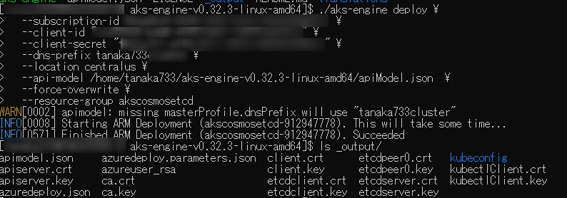
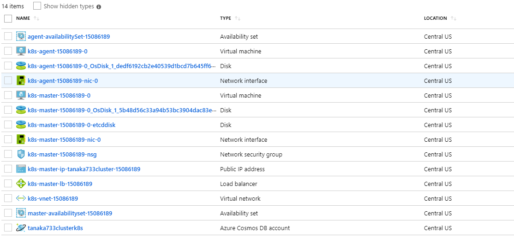
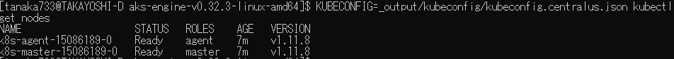
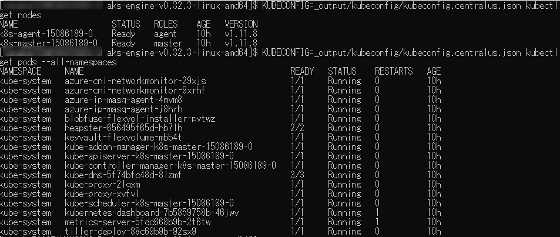

# Cosmos DBのetcd APIをkubernetesのetcdクラスタとして利用する

kubernetesでは必要とする情報の保存先として、分散キーバリュー型ストレージのetcdを利用しています。
AKSの場合、etcdクラスタもマネージドサービスとして提供され、利用者側でメンテナンスする必要はないのですが、よりマネージドかつスケールするサービスとしてCosmos DBのetcd APIを利用する方法が「ASK Engine」を利用したプレビューとして提供されています。
AKSではなく、AKS Engineですので、masterノードを含めてプロビジョニングし管理する必要があります。
なお、内容は参考資料にあるブログ記事の簡易版となります。

## 準備

etcd API in Cosmos DBはprivate previewなので申請フォームから申請して許可される必要があります。 [https://aka.ms/cosmosetcdapi-signup](https://aka.ms/cosmosetcdapi-signup)
リソースプロバイダーでDocumentDBを登録しておきます。

```
az provider register --namespace Microsoft.DocumentDB
```

AKS Engineのv0.32.3が必要なのでダウンロードしておきます。
実行可能ファイルを含むファイル一式なので、プラットフォームごとの圧縮ファイルを取得し、展開しておきます。
[https://github.com/Azure/aks-engine/releases/tag/v0.32.3](https://github.com/Azure/aks-engine/releases/tag/v0.32.3)

AKS Engineを展開するリソースグループを作成します。
現状Cosmos DB etcd APIが利用できるのは`centralus`のみなので、場所は変えられません。

```
az group create --name akscosmosetcd --location "centralus"
```

Service Principakを作成します。

```
az ad sp create-for-rbac --role="Contributor" --scopes="/subscriptions/<subscriptionID>/resourceGroups/akscosmosetcd"
```

以下の内容で`apiModel.json`というファイルを作成します。

```apiModel.json
{
 "apiVersion": "vlabs",
 "properties": {
     "orchestratorProfile": {
         "orchestratorType": "Kubernetes",
         "kubernetesConfig": {
             "useManagedIdentity": false
         }
     },
     "masterProfile": {
         "count": 1,
         "dnsPrefix": "",
         "vmSize": "Standard_D2_v3",
         "cosmosEtcd": true
     },
     "agentPoolProfiles": [
         {
             "name": "agent",
             "count": 1,
             "vmSize": "Standard_D2_v3",
             "availabilityProfile": "AvailabilitySet"
         }
     ],
     "linuxProfile": {
         "adminUsername": "azureuser",
         "ssh": {
             "publicKeys": [
                 {
                     "keyData": ""
                 }
             ]
         }
     }
 }
}
```

先ほど展開したAKS Engineの中に`aks-engine`という実行ファイルがあるので以下のようなコマンドで実行します。

```
./aks-engine deploy \
  --subscription-id <subscriptionID> \
  --client-id <メモしたappId> \
  --client-secret <メモしたpassword> \
  --dns-prefix <適当な一意なDNS prefix> \
  --location centralus \
  --api-model <apiModel.jsonのフルパス>  \
  --force-overwrite \
  --resource-group <作成したリソースグループ名>
```

数分から数十分待つとこのように作成されます。



Azure Portalを見るとCosmos DBを含むリソースが作成されているのが確認できます。



AKS Engineで展開した場合、kubectlなどの接続情報・認証情報は`_output`フォルダの下に出力されます。
kubectlは次のように実行できます。

```
KUBECONFIG=_output/kubeconfig/kubeconfig.centralus.json kubectl get nodes
```




[etcd](https://github.com/etcd-io/etcd/releases/tag/v3.3.13)をインストールするとetcdのCLIであるetcdctlが利用できます。
これを使ってCosmos DBのetcd APIを実行して格納されているデータを見ることができます。
etcdctlでは格納されているキーを名前の前方一致でキーの名前だけ一覧で取得するオプション (<prefix名> --prefix --keys-only)があるのですが、Cosmod DB etcd APIでは利用できずエラーとなります。
そこで値もまとめて出力してみます。（そのため出力量は巨大になります）

```
ETCDCTL_API=3 /tmp/etcd-download-test/etcdctl --cert=_output/etcdclient.crt --key=_output/etcdclient.key --endpoints=https://<CosmosDBの名前>.etcd.cosmosdb.azure.com:2379 get /registry --prefix
```



なお、データの変更・削除なども可能ですが、AKSの動作に問題を起こす可能性があるので注意してください。

# 参考資料

- [Azure Kubernetes with Azure Cosmos DB (preview) を試してみた](https://tech.tanaka733.net/entry/2019/05/azure-kubernetes-with-azure-cosmos-db)
- [How to use Azure Kubernetes with Azure Cosmos DB (preview)](https://docs.microsoft.com/ja-jp/azure/cosmos-db/bootstrap-kubernetes-cluster)