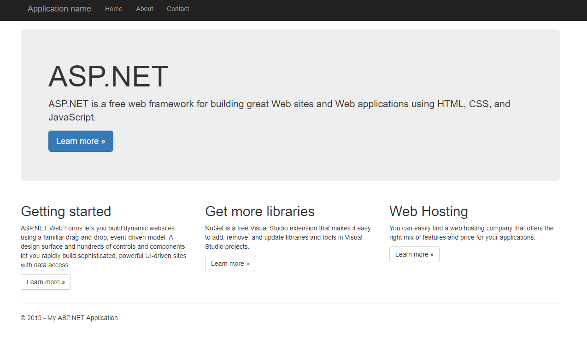
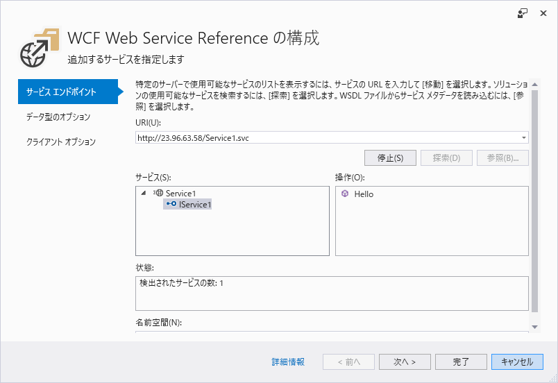

# Windows Server  Node in AKS

Windows Serverをkubernetesのノードとして利用できる機能は以前からありましたが、AKSが管理するノードの一部としてプロビジョニングでする機能がプレビューとして公開されました。
実際に試してみる手順および、Windows ServerコンテナとLinuxコンテナをそれぞれのノードに配置する手順を試します。

## 準備

Windows Server Nodeのプレビュー機能は、AKSの複数nodepool、nodepoolのVMSS対応Azure CLIの拡張という3つのプレビューが必要です。
複数nodepoolとVMSS対応はサブスクリプションレベルで有効になるため、既存のクラスターに影響がでる可能性もあります。
そのため、できるだけほかにAKSクラスターのないサブスクリプションで試すのがよいでしょう。

まず、Azure CLIの拡張機能を追加し、WindowsPreview機能を登録します。

```
az extension add --name aks-preview

az feature register --name WindowsPreview --namespace Microsoft.ContainerService
```

登録完了にはしばらくかかります。
登録状況は次のコマンドで確認でき、`Registered`と表示されれば完了です。

```
az feature list -o table --query "[?contains(name, 'Microsoft.ContainerService/WindowsPreview')].{Name:name,State:properties.state}"
```

```
Name                                       State
-----------------------------------------  ----------
Microsoft.ContainerService/WindowsPreview  Registered
```

登録を反映するために次のコマンドを実行します。

```
az provider register --namespace Microsoft.ContainerService
```

ここからAKSクラスターを作成します。
まず通常のLinuxノードで構成されるAKSを作成した後、Windows Server のNode Poolを追加します。
リソースグループを作成します。

```
az group create --name winnodeaksgroup --location eastus
```

次のコマンドでAKSクラスターを作成します。
Windows Server Nodeはまだプロビジョニングされませんが、ログインユーザーとパスワードを指定する必要があります。

```
az aks create  --resource-group winnodeaksgroup --name winnodeakscluster --node-count 1 --kubernetes-version 1.13.5 --generate-ssh-keys  --windows-admin-password "P@ssw0rd1234"  --windows-admin-username azureuser --enable-vmss --network-plugin azure
```

しばらくして作成が完了したら、kubectlの接続情報を取得し、ノードを確認してみます。

```
az aks get-credentials -g winnodeaksgroup -n winnodeakscluster
kubectl get node
```

次のように表示されます。
これだけではわかりませんが、VMSSでLinuxノードが作成されています。

```
NAME                                STATUS    ROLES     AGE       VERSION
aks-nodepool1-15236465-vmss000000   Ready     agent     5m        v1.13.5
```

次にWindows ServerのNode Poolを追加します。
Node Poolの名前は任意ですが英数字のみで6文字以内である必要があります。

```
az aks nodepool add  --resource-group winnodeaksgroup --cluster-name winnodeakscluster  --os-type Windows --name npwin --node-count 1 --kubernetes-version 1.13.5
```

正常に追加された後`kubectl get node`すると次のようにWindows Server Nodeが追加されていることが確認できます。

```
NAME                                STATUS    ROLES     AGE       VERSION
aks-nodepool1-15236465-vmss000000   Ready     agent     20m       v1.13.5
aksnpwin000000                      Ready     agent     6m        v1.13.5
```

`kubectl describe node`などでノードのラベルを確認すると、`beta.kubernetes.io/os=windows`というラベルでLinuxノードかWindowsノードかを識別できることがわかります。

```
Labels:             agentpool=npwin
                    beta.kubernetes.io/arch=amd64
                    beta.kubernetes.io/instance-type=Standard_D2s_v3
                    beta.kubernetes.io/os=windows
                    failure-domain.beta.kubernetes.io/region=eastus
                    failure-domain.beta.kubernetes.io/zone=0
                    kubernetes.azure.com/cluster=MC_winnodeaksgroup_winnodeakscluster_eastus
                    kubernetes.io/hostname=aksnpwin000000
                    kubernetes.io/role=agent
                    node-role.kubernetes.io/agent=
                    storageprofile=managed
                    storagetier=Premium_LRS
```

## Podの配置

それではWindows ServerノードにPodを配置してみます。
まず、Microsoftが提供しているASP.NET (.NET Framework)のコンテナイメージを利用してみます。
ラベルで両者を識別できるので、`nodeSelector`を次のように指定することでWindows Serverノードにスケジューリングさせることができます。

```
nodeSelector:
  "beta.kubernetes.io/os": windows
```

アプリを配置するためのnamespaceを作成し、`aspnetsample.yaml`を使ってPodとLoadBalancer Serviceを作成します。

```
kubectl create namespace sampleapp
kubectl create -n sampleapp -f aspnetsample.yaml
```

`kubectl get -n sampleapp svc`で外部からの接続先を`EXTERNAL-IP`で確認します。

```
NAME         TYPE           CLUSTER-IP    EXTERNAL-IP     PORT(S)        AGE
sample       LoadBalancer   10.0.96.200   40.80.149.197   80:30182/TCP   4h
```

ブラウザで`http://40.80.149.197`に接続するとASP.NETのサンプルアプリが表示されるはずです。



次に、Windows Server Node側のPodでWCFサービスのサーバーアプリを動かし、Linux Node側でそれに接続するクライアントを.NET CoreアプリのPodで動かしてみます。
WCFもMicrosoftからサンプルアプリのコンテナイメージが提供されているのでそれを使います。
Portを80と808の両方公開しないといけないことに注意してください。

```
kubectl create -n sampleapp -f wcfsample.yaml
```

先ほどと同じように接続先のIPを確認します。

```
kubectl get svc wcfsample
NAME        TYPE           CLUSTER-IP   EXTERNAL-IP   PORT(S)                      AGE
wcfsample   LoadBalancer   10.0.0.166   23.96.63.58   808:30581/TCP,80:32145/TCP   2h
```

.NET CoreでのWCFクライアントアプリのコンテナイメージは用意されていないので準備する必要があります。
作成する際、Visual Studioを利用すると`http://23.96.63.58/Service1.svc`を指定するとサービスに対応したクライアントコードを自動生成できます。



こうして作成したクライアントアプリのイメージを`docker.io/tanakatakayoshi/wcfclientcore`に公開しているのでそちらを利用していただいてもよいです。
接続先のIPアドレスを環境変数で指定できるようになっているため、`wcfclient.yaml`を編集し、以下の`value`のところを変更します。

```
env:
  - name: HOST
    value: "23.96.63.58"
```

このコンテナは実行するとサーバーに接続してすぐに終了するため、Podをjobとして作成します。

```
kubectl create -n sampleapp -f .\wcfclient.yaml

kubectl get po -n sampleapp -o wide
```

このように実行されたPodはCompletedと表示されています。
また、サーバー側のPodはWindows Server Nodeに、クライアント側はLinux Nodeにスケジューリングされていることも確認できます。

```
NAME                        READY     STATUS      RESTARTS   AGE       IP            NODE
wcfclient-r5mlp             0/1       Completed   0          16s       10.240.0.21   aks-nodepool1-15236465-vmss000000
wcfsample-db77bb966-xxgl4   1/1       Running     0          1h        10.240.0.40   aksnpwin000000
```

`kubectl -n sampleapp logs wcfclient-r5mlp`とするとWCFサーバーのAPIから帰ってきたメッセージを確認できます。

```
Hello WCF via Http from Container!
Hello WCF via Net.Tcp from Container!
```

## 参考資料

- [Preview - Create a Windows Server container on an Azure Kubernetes Service (AKS) cluster using the Azure CLI](https://docs.microsoft.com/ja-jp/azure/aks/windows-container-cli)